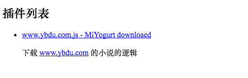

插件商店的实现原理其实跟脚手架差不多，比如 egg-init 、vue-cli ，首先有一个仓库存储了所有的模板与地址列表，所以我先创建了一个[存储的仓库](https://github.com/MiYogurt/reader-store)，然后我又把爬取规则创建了一个仓库， [ybdy_downloader](https://github.com/MiYogurt/ybdy_downloader)。

## 拉取商店列表

首先我们将 loadPlugins 改成 plugins , 这样我们就可以把 plugin 的所有逻辑都放到这个里面来。然后我们将插件保存的目录也改成可配置的。修改 `plugins.ts`

```ts
const pluginsPath = store.get(
  'PLUGIN_PATH',
  resolve(app.getPath('home'), '.reader-app-scripts')
)
ensureDirSync(pluginsPath)
```

修改 `tray.ts`

```ts
PLUGIN_PATH: {
  type: 'path',
  label: ' 插件路径',
  defaultValue: resolve(app.getPath('home'), '.reader-app-scripts')
},
```

修改 `setting.ts` , 我们需要添加一个刷新的逻辑。

```ts
const fetchAllPlugins = (send: any) => {
  // 从远端获取所有新插件
  promisified(storeURL).then((res: any) => {
    let db = []
    try {
      db = JSON.parse(res.body.toString())
    } catch (e) {}
    send('all_plugins', db) // 发送到渲染进程
    store.set('ALL_PLUGINS', db) // 保存到 store
  })
}

on('reload_all_plugins').subscribe(async ({ event, args }) => {
  await fetchAllPlugins(event.sender.send)
  ipcMain.emit('get_all_plugins', event, args) // 触发自己的 get_all_plugins 事件
})

on('get_all_plugins').subscribe(({ event, args }) => {
  const db = store.get('ALL_PLUGINS', [])
  if (db.length > 0) {
    return event.sender.send('all_plugins', db)
  }
  fetchAllPlugins(event.sender.send)
})
```

为了让插件支持热更新，需要通过事件触发更新，假设把 plugin 丢到 store 里面去，由于序列化，会导致爬取方法丢失，所以只能存一下文件名做一下缓存。修改 `index.ts` 的 `ready` 方法，当然也可以用一个方法，比如 `pluginSetUp` 把下面的逻辑包裹一下。

```ts
const load = () => {
  let [_, temPlugins] = loadPlugins()
  plugins = temPlugins
}

load()

on('reload_local_plugins').subscribe(load)
```

再次修改 `plugins.ts` , 我们需要 `filename` 来判断该插件是否已经下载过了, 当接收到 `reload_local_plugins` 信号更新配置，这不仅会触发 `index.ts` 的事件监听，还会触发 `plugins.ts` 里的事件监听。

```ts
const loadPlugins = () => {
  let files = readdirSync(pluginsPath)
  return [
    files, // 文件名，因为要判断本地已安装插件
    files.map(filename =>
      requireFoolWebpack(resolve(pluginsPath, filename))(requireFoolWebpack)
    )
  ]
}
const saveToSetting = (all?: any) => {
  const { event, args } = all
  const [files, _] = loadPlugins()
  store.set('LOACAL_PLUGINS', files) // 将已安装插件，存入 store
  event && ipcMain.emit('get_local_plugins', event, args) // 发送到渲染进程
}
saveToSetting()
on('reload_local_plugins').subscribe(saveToSetting)
on('get_local_plugins').subscribe(({ event, args }) => {
  event.sender.send('local_plugins', store.get('LOACAL_PLUGINS', []))
})
```

## 完成前端

首先安装以下依赖，来支持简介的 `markdown` 渲染支持。

```
npm install marked --save
```

修改 `package.json`，将 `markd` 打包进去，要不然会找不到 `marked`

```json
"electronWebpack": {
    "whiteListedModules": ["marked"]
}
```

新建 `pages/CrawlStore.svelte` , 大多数东西跟 Vue 比较类似，`helpers` 是在模板里面访问的方法，它是纯函数，不具备 `this` 的访问能力。在 `oncreate` 的时候通过事件捕获 `a` 标签的点击，使用浏览器打开链接，以及拉取数据。

```html
<h2>插件列表</h2>

<ul ref:list>
    {#each plugins as plugin}
    <li>
        <a target="_blank" href={plugin.repository}>{plugin.filename} - {plugin.author} { plugin.downloaded ? 'downloaed' : ''}</a>
        <p>{@html marked(plugin.description || '')}</p>
    </li>
    {/each}
</ul>

<script>
    import {
        ipcRenderer as ipc,
        shell
    } from 'electron'
    import marked from 'marked'

    function addDownloaed(plugins, local_plugins) {
        return plugins.map(plugin => {
            plugin.downloaded = local_plugins.findIndex(local_plugin => local_plugin == plugin.filename) >= 0
            return plugin
        })
    }
    export default {
        data() {
            return {
                local_plugins: [],
                all_plugins: []
            }
        },
        helpers: {
            marked,
        },
        computed: {
            plugins: ({
                all_plugins,
                local_plugins
            }) => addDownloaed(all_plugins, local_plugins)
        },
        oncreate() {
            ipc.send('get_all_plugins')
            ipc.send('get_local_plugins')
            ipc.on('all_plugins', (event, all_plugins) => {
                this.set({
                    all_plugins
                })
            })
            ipc.on('local_plugins', (event, local_plugins) => {
                this.set({
                    local_plugins
                })
            })
            this.refs.list.addEventListener("click", (e) => { // 处理插件的打开链接
                if (e.target.tagName.toLowerCase() == 'a') {
                    e.preventDefault()
                    shell.openExternal(e.target.href)
                }
            }, true)
        }
    }
</script>
```

最后别忘记在 App.svelte 里面引入并装载它。

现在的结果看起来会像下面这样，因为还没有任何样式，所以可能看起来比较简陋。



## 实现路由与全局状态

我们来为 svelte 添加路由支持，svelte 自身是不带路由组件的， 因为作者更希望开发者自己去控制，所以也导致了难度有一些提升。

由于我们是 Electron 环境，没必要在意浏览器的 url 是什么，所以我们根本就不需要关心浏览器前进、后退的兼容，与参数解析。

下面是几个 svlte 路由的库和例子，大家想研究的话可以去看一下

- https://github.com/krasimir/navigo
- https://github.com/ilog2000/svelte-navigo
- https://github.com/EmilTholin/svelte-routing
- https://github.com/Rich-Harris/roadtrip

## 创建 store.js

为了持久化存储，Svelte 自带了全局状态管理，为了更好的项目结构，我们将之前写好的页面都放到 pages 文件下。

```ts
import { Store } from 'svelte/store.js'
import Status from './pages/Status.svelte'
import Download from './pages/Download.svelte'
import CrawlStore from './pages/CrawlStore.svelte'

const store = new Store({
  currentPage: Status // 当前页面
})

store.changePage = changePage.bind(store)

function changePage(pageName) {
  const map = {
    Status,
    Download,
    CrawlStore
  }
  const current = store.get().currentPage //当前页
  store.set({ currentPage: map[pageName] || current })
}

export { changePage }

export default store
```

我是直接通过  添加到实例上面添加的方法，大家也可以参考官方的文档，按照官方的例子去做。

这里我们通过 `changePage` 来修改 currentPage 变量，然后我们把 currentPage 绑定到动态组件上面去，这样我们就实现了路由。

## 修改 App.svelte

```html
<Link className="Hello" to="Download">下载页面</Link>
<Link className="Hello" to="Status">状态</Link>
<Link className="Hello" to="CrawlStore">爬虫商店</Link>
<svelte:component this="{$currentPage}" />

<script>
    export default {
        components: {
            Link: './components/Link.svelte'
        }
    };
</script>
```

这样我们就实现了路由，但是我们还需要切换，所有我们构建一个 Link 组件。

## 跳转组件

新建 `components/Link.svelte` ，阻止默认事件，修改全局状态即可。

```html
<a class={className} href={to} ref:link>
    <slot/>
</a>

<script>
    export default {
        oncreate() {
            this.refs.link.addEventListener('click', (e) => {
                e.preventDefault(); // 阻止默认事件
                this.store.changePage(this.get().to)
            }, false)
        }
    }
</script>
```
