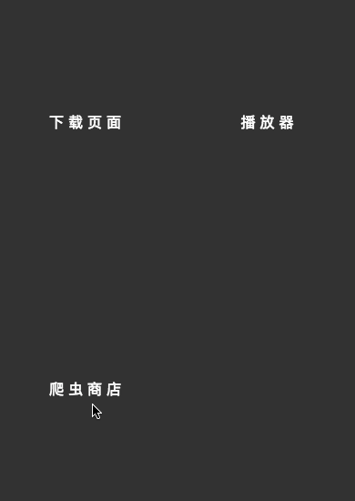

首先我们来看效果。



 本章修改的内容比较多，因为牵扯了比较多的前端样式，可以运行的代码在[这里](https://github.com/MiYogurt/electron-svelte-template/tree/store-download-and-delete) 大家可以对照查漏补缺。

## 接受下载和删除信号

首先对 `plugins.ts` 进行更新，添加相应的处理逻辑，为了避免错漏，笔者把所有代码都贴了出来。这里对之前的一些方法做了简单的更新。对于监听的事件可以通过 emit 触发，因为继承 EventEmitter 类。当我们刷新或者下载的时候我们都需要更新缓存。

```ts
import { app, ipcMain } from 'electron'
import { resolve } from 'path'
import { readdirSync, ensureDirSync, writeFile, remove } from 'fs-extra'
import requireFoolWebpack from 'require-fool-webpack'
import { store } from './tray'
import { promisified } from 'phin'
import { on } from './helper'

const pluginsPath = store.get(
  'PLUGIN_PATH',
  resolve(app.getPath('home'), '.reader-app-scripts')
)
ensureDirSync(pluginsPath)

// https://github.com/webpack/webpack/issues/196
// https://github.com/sindresorhus/require-fool-webpack

const loadPlugins = () => {
  let files = readdirSync(pluginsPath)
  return [
    files,
    files.map(filename =>
      requireFoolWebpack(resolve(pluginsPath, filename))(requireFoolWebpack)
    )
  ]
}
const saveToSetting = (all?: any) => {
  const [files, _] = loadPlugins()
  store.set('LOACAL_PLUGINS', files)
  all && ipcMain.emit('get_local_plugins', all.event, all.args)
}

saveToSetting()

on('reload_local_plugins').subscribe(saveToSetting)
on('get_local_plugins').subscribe(({ event, args }) => {
  event.sender.send('local_plugins', store.get('LOACAL_PLUGINS', []))
})

const storeURL =
  'https://raw.githubusercontent.com/MiYogurt/reader-store/master/db.json'

const fetchAllPlugins = (event: any) => {
  promisified(storeURL).then((res: any) => {
    let db = []
    try {
      db = JSON.parse(res.body.toString())
    } catch (e) {}
    event.sender.send('all_plugins', db)
    store.set('ALL_PLUGINS', db)
  })
}

on('reload_all_plugins').subscribe(async ({ event, args }) => {
  await fetchAllPlugins(event)
  ipcMain.emit('get_all_plugins', event, args)
})

on('get_all_plugins').subscribe(({ event, args }) => {
  const db = store.get('ALL_PLUGINS', [])
  if (db.length > 0) {
    return event.sender.send('all_plugins', db)
  }
  fetchAllPlugins(event.sender.send)
})

// 下载插件
on('download_plugin').subscribe(async ({ event, args }) => {
  const { filename, url } = args
  await promisified(url)
    .then(({ body }) => body.toString())
    .then(data => (console.log(data), data)) // 查看一下数据内容
    .then(data => writeFile(pluginsPath + '/' + filename, data)) // 写入插件
  ipcMain.emit('reload_local_plugins', event, args) // 刷新
  event.sender.send('download_plugin_success', filename)
})

// 删除插件
on('delete_plugin').subscribe(async ({ event, args }) => {
  const { filename } = args
  await remove(pluginsPath + '/' + filename)
  ipcMain.emit('reload_local_plugins', event, args) // 刷新
  event.sender.send('delete_plugin_success', filename)
})

export default loadPlugins
```

## 前端优化

首先我们安装一下依赖，transitions 里面是动画指令，extras 里面是帮助方法，比如数组的 push。

```bash
npm install --save svelte-transitions svelte-extras
```

修改 `package.json`，添加打包白名单。

```json
"whiteListedModules": [
    "marked",
    "svelte-transitions",
    "svelte-extras"
],
```

## 自定义模板

新建 `src/index.ejs` ，文档里面没有说明如何自定义模板，但是源码里面有处理逻辑。`-webkit-app-region` 是为了让无边框的 App 可以支持拖动。

```html
<!DOCTYPE html>
<html lang="zh-CN">

<head>
    <meta charset="UTF-8">
    <meta name="viewport" content="width=device-width, initial-scale=1.0">
    <meta http-equiv="X-UA-Compatible" content="ie=edge">
    <title>App</title>
    <style>
        html {
            background: #fff;
            -webkit-app-region: drag
        }

        * {
            font-family: "PingFang SC";
            margin: 0;
            padding: 0;
            box-sizing: border-box;
        }
    </style>
</head>

<body>
    <div id="app"></div>
</body>

</html>
```

## 添加全局消息组件

新建 `compoennts/Tip.svelte`，这个用于全局消息提示。

```html
{#if $msg.content.length}
<p class={$msg.type} transition:slide>{$msg.content}</p>
{/if}

<script>
    import {
        slide
    } from 'svelte-transitions'
    export default {
        transitions: {
            slide
        },
    }
</script>
<style>
    .info {
        background: #6633FF;
    }

    .warring {
        background: #FF9900;
    }

    .success {
        background: #4BCB7C;
    }

    p {
        line-height: 60px;
        text-align: center;
        color: #fff;
        font-size: .9rem;
        letter-spacing: 5px;
        cursor: default;
        user-select: none;
        display: block;
        transition: background .5s;
    }

    @keyframes flash {
        0% {
            opacity: 0;
        }
        100% {
            opacity: 1;
        }
    }

    p::after,
    p::before {
        animation: flash .7s ease-in infinite alternate
    }

    p::after {
        content: '·'
    }

    p::before {
        content: '·'
    }
</style>
```

## 定义全局状态

添加好这些方法，当然别忘记在 `store` 里面初始化 `msg`，这些都是提示消息的帮助方法。

```js
function setMsg(type, content) {
  store.set({
    msg: {
      type,
      content
    }
  })
}

function resetMsg() {
  store.set({
    msg: {
      type: 'info',
      content: ''
    }
  })
}

function success(content, timer = 1000) {
  store.set({
    msg: {
      type: 'success',
      content
    }
  })
  setTimeout(resetMsg, timer)
}

store.setMsg = setMsg.bind(store)
store.success = success.bind(store)
```

## 修改 App.svelte

添加全局提示组件

```html
<Tip/>
<svelte:component this="{$currentPage}" name="page" />

<script>
    export default {
        components: {
            Tip: './components/Tip.svelte'
        },
    };
</script>
```

## 添加回退按钮

就像手机端回退的按钮一样，新建 `components/Back.svelte`，这里的按钮我们通过 css 画出来。

```html
<Link className="back" to="Main"><i class="back-icon"></i></Link>

<script>
    export default {
        components: {
            Link: './Link.svelte'
        }
    }
</script>

<style>
    .back-icon {
        border-left: 4px solid #fff;
        border-bottom: 4px solid #fff;
        display: inline-block;
        width: 15px;
        height: 15px;
        border-radius: 2px;
        transform: rotate(45deg);
        margin: 8px 8px 8px 0.8rem;
    }

     :global(.back) {
        width: 100%;
        height: 60px;
        background: #383A41;
        display: flex;
        align-items: center;
    }
</style>
```
