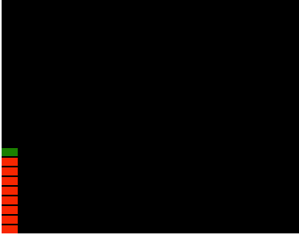
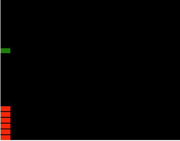
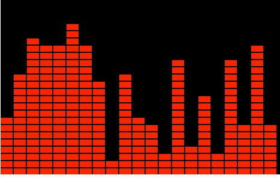
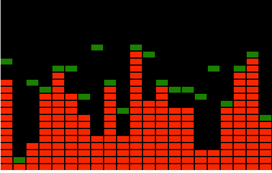

## 方块版本

添加绿色的至高点，使用 setTimeout 放慢速度便于观察。



```js
let GreenHight = 0

function Run() {
  let ramdom = 255 * Math.random()
  let maxSize = 20 // -> 255
  currentSize = Math.ceil((ramdom / 255) * maxSize)
  ctx.clearRect(0, 0, width, height)

  ctx.fillStyle = 'red'
  for (let i = 0; i <= currentSize; i++) {
    ctx.fillRect(0, height - (i + 1) * h - margin * i, w, h)
  }

  ctx.fillStyle = 'green'

  currentGreenHight = height - (currentSize + 1) * h - margin * currentSize // 至高点

  ctx.fillRect(0, currentGreenHight, w, h)
  setTimeout(Run, 500)
}

Run()
```

我们希望绿色的砖块可以被顶上去，下来的时候做自由落体。让绿色的下降速度为，每帧下降一个小块的高度，当下降超过之高点就停在制高点的位置。

这里要特别注意 y 轴的坐标，0 是左上角，最大是左下角。绿色球越往下落，y 越大，当与至高点的碰撞的时候，让他就等于至高点的位置，测试的时候发现会跌过头了，所以加了个 `2 * v` 或者 `v` 都行。



```js
let GreenHight = height

let v = h + margin // 下降速度

function Run() {
  let ramdom = 255 * Math.random()
  let maxSize = 20 // -> 255
  currentSize = Math.ceil((ramdom / 255) * maxSize)
  ctx.clearRect(0, 0, width, height)

  ctx.fillStyle = 'red'
  for (let i = 0; i <= currentSize; i++) {
    ctx.fillRect(0, height - (i + 1) * h - margin * i, w, h)
  }

  ctx.fillStyle = 'green'

  currentGreenHight = height - (currentSize + 1) * h - margin * currentSize // 制高点  y 坐标。

  // 大 下面
  // 小 上面

  console.log(GreenHight)
  console.log(currentGreenHight)

  if (GreenHight + v > currentGreenHight) {
    // 比最高点还大，跌过头了
    // 保证等会的 + v 也不过头
    GreenHight = currentGreenHight
    ctx.fillRect(0, GreenHight, w, h)
  } else {
    GreenHight += v
    ctx.fillRect(0, GreenHight, w, h)
  }

  setTimeout(Run, 30)
}

Run()
```

想让下落幅度大一点？

```js
let v = (h + margin) * 3 // 下降速度
```

接下来实现纵向的逻辑



```js
function Run() {
  ctx.clearRect(0, 0, width, height)
  ctx.fillStyle = 'red'
  let widthSize = 20 // 横向列数
  for (let j = 0; j <= widthSize; j++) {
    let ramdom = 255 * Math.random()
    let maxSize = 20
    currentSize = Math.ceil((ramdom / 255) * maxSize)
    for (let i = 0; i <= currentSize; i++) {
      ctx.fillRect(j * w + margin * j, height - (i + 1) * h - margin * i, w, h)
    }
  }
  setTimeout(Run, 500)
}
```

添加绿色方块，oh~ 诶瑞巴蒂，跟我一起 high。把之前的绿块高度用数组保存。因为里面的循环是 <= 所以，应该  `new Array` 还要加一个。



```js
let widthSize = 20
let GreenHightArray = new Array(widthSize + 1).fill(height)
let v = (h + margin) * 3 // 下降速度
function Run() {
  ctx.clearRect(0, 0, width, height)
  for (let j = 0; j <= widthSize; j++) {
    let ramdom = 255 * Math.random()
    let maxSize = 20 // -> 255
    currentSize = Math.ceil((ramdom / 255) * maxSize)

    for (let i = 0; i <= currentSize; i++) {
      ctx.fillStyle = 'red'

      ctx.fillRect(j * w + margin * j, height - (i + 1) * h - margin * i, w, h)
    }
    // 绿块逻辑
    ctx.fillStyle = 'green'

    currentGreenHight = height - (currentSize + 1) * h - margin * currentSize // 制高点  y 坐标。

    if (GreenHightArray[j] + 2 * v > currentGreenHight) {
      GreenHightArray[j] = currentGreenHight
      ctx.fillRect(j * w + margin * j, GreenHightArray[j], w, h)
    } else {
      GreenHightArray[j] += v
      ctx.fillRect(j * w + margin * j, GreenHightArray[j], w, h)
    }
  }
  setTimeout(Run, 500)
}

Run()
```
