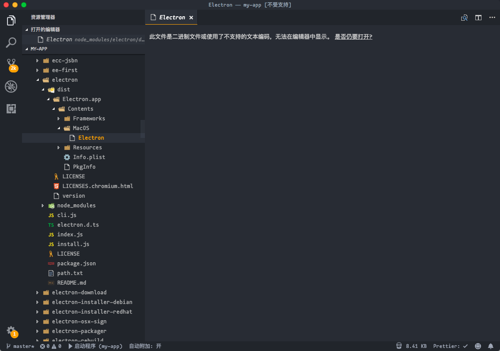
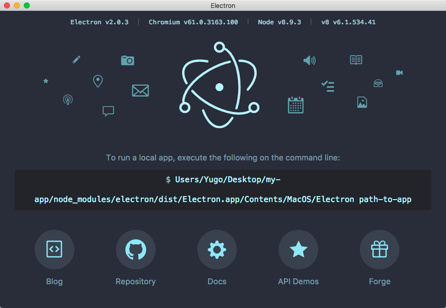
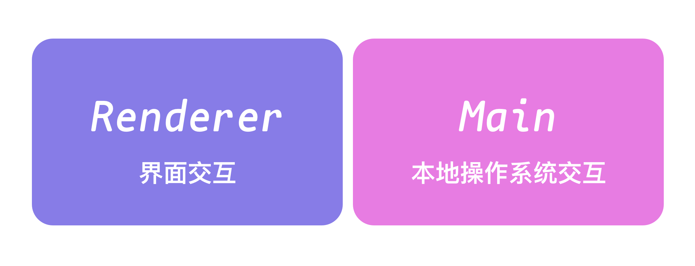
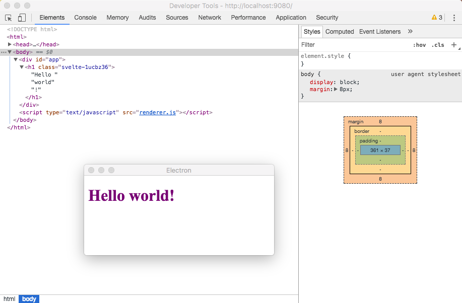

# 了解 Electron 开发环境

## 黑盒子 Electron

[Electron](https://electronjs.org/) 可以看做是包含 Node 和 Chromium 黑盒的程序启动器，在官网有这样一段代码。

```sh
$ npm i -D electron@latest
# Electron   2.0.4
# Node       8.9.3
# Chromium   61.0.3163.100
```

当我们安装好了一个 electron 程序，它自身会有一个版本号，同时包含了 Node 环境与 Chromium 浏览器环境，我们再来看一下安装好的依赖是怎么样的。



当我们运行 electron 的时候，它运行的其实是这个二进制文件，就像运行 node 一样，运行的时候，我们会指定一个 index.js 文件作为入口点，在这个入口点里面创建窗口，操作本地系统等等。这也是为什么我说它是一个黑盒。

当然运行这个二进制，不是把它加入到 PATH 环境里面，而是通过 Node 的 `child_process` 呼起一个进程。这个 `Electron.app` 文件，在 Mac 下面是可以直接运行的，下面就是运行的结果。



## 必知的进程概念

当我们开发一个本地应用的时候，免不了的就要访问本地的文件，浏览器很明显不具备这样的功能。同时还要有访问网络的能力，或许 Node 可以胜任，因为它可以访问文件和访问网络，那么用户交互界面怎么办呢？普通用户会愿意去面对一个控制台么？于是乎，为啥不把浏览器和 Node 结合起来，浏览器负责显示界面，Node 负责访问网络和其他的这不就好了么。

是的，没错，就这样 Electron 诞生了，但是这里面有非常多的工作，比如环境的整合，执行的架构等等。在前面提到交互界面与访问本地文件与网络两个功能，在 Electron 中，就刚好有两个进程相互对应，有点类似于前端框架的服务端渲染，也有是说它有两个运行环境。



但是呢，在渲染进程里面，还是可以访问本地文件模块的，也就是说 Node 的 API 是交融在一起的，两个进程之间通过 ipc 进行通行，官方封装好了对应的模块。通信代码会与下面的代码类似。

**在主进程中**

```js
const { ipcMain } = require('electron')
// 异步返回
ipcMain.on('asynchronous-message', (event, arg) => {
  event.sender.send('asynchronous-reply', 'pong')
})
// 同步返回 -> 会阻塞渲染进程
ipcMain.on('synchronous-message', (event, arg) => {
  event.returnValue = 'pong'
})
```

**在渲染进程中**

```js
const { ipcRenderer } = require('electron')
// 同步接收
console.log(ipcRenderer.sendSync('synchronous-message', 'ping'))
// 异步接收
ipcRenderer.on('asynchronous-reply', (event, arg) => {
  console.log(arg)
})
```

## 开发环境的更新与重启

Electron 程序中，对于渲染进程实现热替换跟浏览器其实是一样的，当我们新建了一个窗口的时候，在生产环境的时候可能是载入一个 html 文件，当在开发环境的时候则是载入一段 http 协议的网址，当更新了的时候通过 websocket 通知页面刷新即可。

而对于主进程则没有热更新，只能把进程杀死再重启，等会我会讲解 electron-vue 脚手架的核心原理。

## 我自己的解决方案

在我写的[图片压缩应用](https://github.com/MiYogurt/mmmmh)中，使用了 `chokidar` 和一段脚本实现了热重启。在启动脚本中有这样一段 `scripts` 命令

```json
"dev": "chokidar './src/*.js' -c './scripts/dev.sh' --initial"
```

启动脚本为

```shell
#!/usr/bin/env bash

function check(){
  count=`ps -ef |grep $1 |grep -v "grep" |wc -l`

  if [ 0 -ne $count ];then
    echo "Kill Electron"
    killall $1
  fi
}

check "Electron" && yarn start
```

这样的方式虽然可以很简单，但是会误杀掉所有的 Electron 程序，通过下面的方式杀死进程可能会更好一些。

```sh
pkill -f project_name
```

## electron-vue 的解决方案

其他类的脚手架也是类似的原理，通过编程的方式，操作 `process` 来杀死进程。首先打开 [dev-runner.js](https://github.com/SimulatedGREG/electron-vue/blob/4c6ee7bf4f9b4aa647a22ec1c1ca29c2e59c3645/template/.electron-vue/dev-runner.js) 文件，关于打包的事，我就不多说了，做这种打包方案难倒是不难，参考非常多，就是查 Webpack API 比较麻烦，需要花不少时间，特别是做服务端渲染配置的时候也是这样，

`startRenderer` 函数，载入了渲染进程 webpack 配置，通过 `WebpackDevServer` 监听了 `9080`端口，而 `startMain` 函数里面有这样一段。它监听了主线程文件修改，当修改通过 `process.kill` 杀死，并调用 `startElectron` 重启，并且有一个 `manualRestart` 标志位避免频繁重启，

```javascript
compiler.watch({}, (err, stats) => {
  if (err) {
    console.log(err)
    return
  }

  logStats('Main', stats)

  if (electronProcess && electronProcess.kill) {
    manualRestart = true
    process.kill(electronProcess.pid)
    electronProcess = null
    startElectron()

    setTimeout(() => {
      manualRestart = false
    }, 5000)
  }
})
```

在 `startElectron` 中通过子进程启动 electron 程序、

```javascript
function startElectron() {
  electronProcess = spawn(electron, ['--inspect=5858', '.'])

  electronProcess.stdout.on('data', data => {
    electronLog(data, 'blue')
  })
  electronProcess.stderr.on('data', data => {
    electronLog(data, 'red')
  })

  electronProcess.on('close', () => {
    if (!manualRestart) process.exit()
  })
}
```

## electronforge

[electronforge](https://electronforge.io/) 提供了一体化的 electron 开发体验，从 node 版本替换到打包，自动上传等等，是非常方便的，但是呢，本教程不会用这个脚手架，基于两点考虑。

- v6 版本尚未发布，一直处于 beta 阶段，估计要等 electron3

- 封装的太高了，反而啥都学不到了，我会尽量使用偏底层的各种包，让大家接触更多技术点。

## electron-webpack

这将会是我们使用的开发脚手架，我会以添加 svelte 框架为例，教大家自定义 webpack 配置。它的原理其实就是上面 electron-vue 所提到的那样，不过它的 config 载入的逻辑要多很多。阅读 [文档](https://webpack.electron.build/) 获取更多帮助信息。

现在我们来初始化我们的脚手架。

```shell
git clone https://github.com/electron-userland/electron-webpack-quick-start.git reading-app
cd reading-app
rm -rf .git
npm install
```

为了使下载速度更快，我们可以使用国内的镜像。对于 zsh 或者 bash ，设置 `ELECTRON_MIRROR` 环境变量即可

```sh
export ELECTRON_MIRROR=https://npm.taobao.org/mirrors/electron/
```

fish 使用

```sh
set -x ELECTRON_MIRROR https://npm.taobao.org/mirrors/electron/
```

## 安装依赖

要使用 webpack 构建 svelte ，首先要安装它的依赖，由于 svelte 是编译型的框架，所以安装到开发依赖即可。

```sh
npm install svelte svelte-loader --save-dev
```

然后我们开始自定义渲染进程的 webpack 配置，我们需要参考一下 [electron-webpack 文档](https://webpack.electron.build/modifying-webpack-configurations) 和 [svelte 官网模板配置](https://github.com/sveltejs/template-webpack/blob/master/webpack.config.js) 假如你完全按照它的来，你得到的错误会莫名奇妙，不信你可以尝试一下，假如你的对调试不熟悉一些的话，可能你永远也不会知道它问题出在哪。

首先修改 `package.json`

```json
"electronWebpack": {
    "renderer": {
      "webpackConfig": "conf/webpack.renderer.additions.js"
    }
 },
```

然后创建该文件，配置如下：

```javascript
module.exports = {
  resolve: {
    extensions: ['.js', '.svelte'],
    mainFields: ['svelte', 'browser', 'module', 'main']
  },
  module: {
    rules: [
      {
        test: /\.svelte$/,
        exclude: /node_modules/,
        use: {
          loader: 'svelte-loader',
          options: {
            skipIntroByDefault: true,
            nestedTransitions: true,
            emitCss: true,
            hotReload: true
          }
        }
      }
    ]
  }
}
```

不要配置 css，因为会造成重复，所以才导致莫名奇妙的问题，配置 `mainFields` 是为了假如你想导入 `svelte` 组件，可以被识别。

不使用 html 后缀是为了避免冲突，要不然 js 代码会被当做字符串载入。

## 添加渲染进程内容

关于 Svelte 可以查看[官方文档](https://svelte.technology/)，我[录制的视频](https://nodelover.me/course/svelte-introduction-guide)可能有些老了

修改 `renderer/index.js` 的内容

```javascript
import App from './App.svelte'

const app = new App({
  target: document.querySelector('#app'),
  data: {
    name: 'world'
  }
})
```

新增 `renderer/App.svelte` 文件

```html
<h1>Hello {name}!</h1>

<style>
  h1 {
    color: purple;
  }
</style>
```

## 运行 App

```sh
npm run dev
```



## 学习 Svelte 的方法

先看一遍它的 [demo](https://svelte.technology/repl?demo=hello-world)，然后看[文档](https://svelte.technology/guide#introduction)
