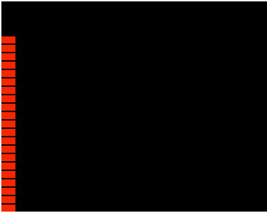

先构建一个基础页面，左上角画一个矩形。


```html
<!DOCTYPE html>
<html lang="en">
<head>
  <meta charset="UTF-8">
  <title>canvas Test</title>
  <style type="text/css">
    #box {
      background: #000;
    }
  </style>
</head>
<body>
  <canvas id="box" width="600" height="300"></canvas>
  <script type="text/javascript">
    const cvs = document.querySelector('#box');
    const ctx = cvs.getContext('2d');
    console.log(ctx);

    // https://developer.mozilla.org/zh-CN/docs/Web/API/CanvasRenderingContext2D/fillRect
    ctx.fillStyle = "red";
    ctx.fillRect(0, 0, 20, 10)

  </script>
</body>
</html>
```

## 基础

我想让它在左下角


```js
const height = cvs.height
const width = cvs.width

ctx.fillStyle = 'red'
ctx.fillRect(0, height - 10, 20, 10)
```

画两个接起来，然后用变量来标识它们，然后找规律。

```js
w = 20
h = 10

ctx.fillStyle = 'red'

ctx.fillRect(0, height - h, w, h)
ctx.fillRect(0, height - 2 * h - 2, w, h)
```

多弄几个再找。

```js
w = 20
h = 10

ctx.fillStyle = 'red'
ctx.fillRect(0, height - h, w, h)
ctx.fillRect(0, height - 2 * h - 2, w, h)
ctx.fillRect(0, height - 3 * h - 4, w, h)
ctx.fillRect(0, height - 4 * h - 6, w, h)
```

然后再补一些变量，这样就找到规律了。

```js
ctx.fillRect(0, height - 1 * h - 0, w, h)
ctx.fillRect(0, height - 2 * h - 2, w, h)
ctx.fillRect(0, height - 3 * h - 4, w, h)
ctx.fillRect(0, height - 4 * h - 6, w, h)
```

用循环写出来。

```js
let w = 20
let h = 10
let margin = 2 // 间隔
let size = 4 // 方块数目
ctx.fillStyle = 'red'
for (let i = 0; i <= size; i++) {
  ctx.fillRect(0, height - (i + 1) * h - margin * i, w, h)
}
```

假设有一个 255 以内的随机数据，我们要映射到一个 20 的范围，获取百分比，乘以最大值即可。

```js
let ramdom = 255 * Math.random()
let maxSize = 20 // -> 255
currentSize = Math.ceil((ramdom / 255) * maxSize)
console.log(currentSize)
```

每一帧都设置这个值，这样就动起来了。



```js
function Run() {
  let ramdom = 255 * Math.random()
  let maxSize = 20 // -> 255
  currentSize = Math.ceil((ramdom / 255) * maxSize)
  ctx.clearRect(0, 0, width, height)
  for (let i = 0; i <= currentSize; i++) {
    ctx.fillRect(0, height - (i + 1) * h - margin * i, w, h)
  }
  requestAnimationFrame(Run)
}

Run()
```
