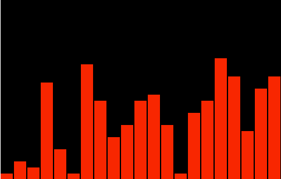
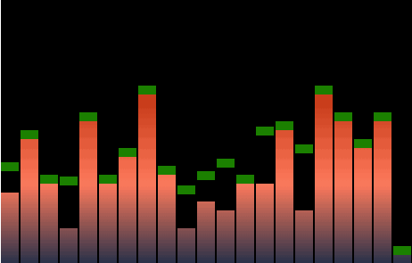
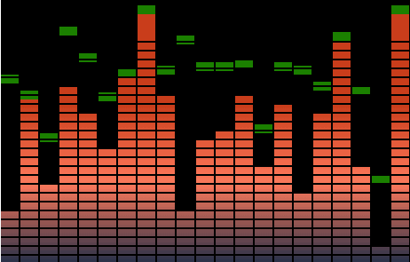
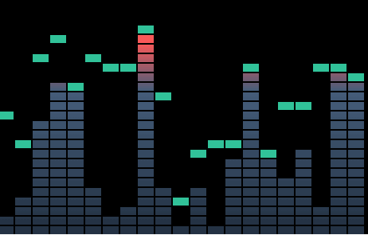

## 渐变版本

没有渐变，似乎总少点什么，可不可以来点渐变。假如上渐变的话，需要改变一下思路，这个思路更加优秀，绘制的数量更少。对于这种间隔，我们通过 clearRect 清楚即可。

现在都是确定高度，然后以全局高度减去矩形高度为坐标 y，画完的小方块刚好以底部对齐。

`show me code`



```js
let widthSize = 20
let GreenHightArray = new Array(widthSize + 1).fill(height)
let v = (h + margin) * 3
let maxSize = 20
function Run() {
  ctx.clearRect(0, 0, width, height)

  for (let j = 0; j <= widthSize; j++) {
    let ramdom = 255 * Math.random()

    currentSize = Math.ceil((ramdom / 255) * maxSize)

    ctx.fillStyle = 'red'

    ctx.fillRect(
      j * w + margin * j,
      height - h * currentSize,
      w,
      h * currentSize
    )
  }
  setTimeout(Run, 500)
}

Run()
```

添加渐变样式

```js
let g = ctx.createLinearGradient(0, height, 0, 0)
g.addColorStop(0, '#283149')
g.addColorStop(0.3, '#ff7a5c')
g.addColorStop(0.6, '#c93d1b')
ctx.fillStyle = g
```

添加小绿块



```js
function Run() {
  ctx.clearRect(0, 0, width, height)

  for (let j = 0; j <= widthSize; j++) {
    let ramdom = 255 * Math.random()

    currentSize = Math.ceil((ramdom / 255) * maxSize)

    let g = ctx.createLinearGradient(0, height, 0, 0)
    g.addColorStop(0, '#283149')
    g.addColorStop(0.3, '#ff7a5c')
    g.addColorStop(0.6, '#c93d1b')
    ctx.fillStyle = g

    ctx.fillRect(
      j * w + margin * j,
      height - h * currentSize,
      w,
      h * currentSize
    )

    // 绿块逻辑
    ctx.fillStyle = 'green'

    currentGreenHight = height - currentSize * h // 制高点 y 坐标。

    if (GreenHightArray[j] + v > currentGreenHight) {
      GreenHightArray[j] = currentGreenHight
      console.log(j)
      ctx.fillRect(j * w + margin * j, GreenHightArray[j], w, h)
    } else {
      GreenHightArray[j] += v
      ctx.fillRect(j * w + margin * j, GreenHightArray[j], w, h)
    }
  }
  setTimeout(Run, 500)
}

Run()
```

分割网格



```js
let widthSize = 20
let GreenHightArray = new Array(widthSize + 1).fill(height)
let v = (h + margin) * 2 // 下降速度

let maxSize = 30 // -> 255
let lines = Math.ceil(height / (h + margin)) // 计算行数
function Run() {
  ctx.clearRect(0, 0, width, height)

  for (let j = 0; j <= widthSize; j++) {
    let ramdom = 255 * Math.random()
    currentSize = Math.ceil((ramdom / 255) * maxSize)

    let g = ctx.createLinearGradient(0, height, 0, 0)
    g.addColorStop(0, '#283149')
    g.addColorStop(0.3, '#ff7a5c')
    g.addColorStop(0.6, '#c93d1b')
    ctx.fillStyle = g

    ctx.fillRect(
      j * w + margin * j,
      height - h * currentSize,
      w,
      h * currentSize
    )

    // 绿块逻辑
    ctx.fillStyle = 'green'
    currentGreenHight = height - currentSize * h // 制高点 y 坐标。

    if (GreenHightArray[j] > currentGreenHight) {
      GreenHightArray[j] = currentGreenHight
      ctx.fillRect(j * w + margin * j, GreenHightArray[j], w, h)
    } else {
      GreenHightArray[j] += v
      ctx.fillRect(j * w + margin * j, GreenHightArray[j], w, h)
    }
  }
  for (var i = 0; i <= lines; i++) {
    ctx.clearRect(0, height - i * h, width, margin)
  }
  setTimeout(Run, 500)
}
Run()
```

上面切割的不准确，说明某处的 `margin` 没加上。仔细检查，现在所有的块绘制的高度都是 `h + margin`，然后用 clearRect 进行切割。



```js
let w = 20
let h = 10

let margin = 2 // 间隔

// let GreenHight = height
let widthSize = 20
let GreenHightArray = new Array(widthSize + 1).fill(height)
let v = (h + margin) * 3 // 下降速度

let maxSize = 24 // -> 255
let lines = Math.ceil(height / (h + margin)) // 计算行数

function Run() {
  ctx.clearRect(0, 0, width, height)

  for (let j = 0; j <= widthSize; j++) {
    let ramdom = 255 * Math.random()
    currentSize = Math.ceil((ramdom / 255) * maxSize)

    let g = ctx.createLinearGradient(0, height, 0, 0)
    g.addColorStop(0, '#233142')
    g.addColorStop(0.6, '#455d7a')
    g.addColorStop(0.8, '#f95959')
    ctx.fillStyle = g

    ctx.fillRect(
      j * w + margin * j,
      height - (h + margin) * currentSize,
      w,
      (h + margin) * currentSize
    )

    // 绿块逻辑
    ctx.fillStyle = 'green'

    currentGreenHight = height - currentSize * (h + margin) // 制高点 y 坐标。

    if (GreenHightArray[j] + v > currentGreenHight) {
      GreenHightArray[j] = currentGreenHight
      ctx.fillRect(j * w + margin * j, GreenHightArray[j], w, h + margin)
    } else {
      GreenHightArray[j] += v
      ctx.fillRect(j * w + margin * j, GreenHightArray[j], w, h + margin)
    }
  }
  for (var i = 0; i <= lines; i++) {
    ctx.clearRect(0, height - i * (h + margin), width, margin)
  }
  setTimeout(Run, 500)
}
Run()
```
