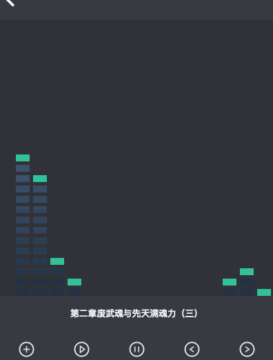

有了之前的原理，现在我们只需要拿到音频的数据即可。

## 模板

添加一个 `canvas` 来承载音频图像。

```html
<div class="music-page { $music ?'show':'hidden' } ">
    <Back/>
    <div>
        <ul class="main {list?'hidden':'show'}">
            {#each files as file, index}
            <li on:click="$set({index})">{handleName(file)}</li>
            {/each}
        </ul>
        <div class="main play-canvs {list?'show':'hidden'}" on:click="toggleList()">
            <canvas ref:box width="400" height="400"></canvas>
        </div>
        <div class="control">
            <div class="title" on:click="toggleList()">{title}</div>
            <div class="flex">
                <button on:click="file()"></button>
                <button on:click="play()"></button>
                <button on:click="pause()"></button>
                <button on:click="prev()"></button>
                <button on:click="next()"></button>
            </div>
        </div>
    </div>
</div>
```

修改 `oncreate` 钩子函数，创建音频编辑器，和分析器。

```js
this.ac = new AudioContext()
this.analyser = this.ac.createAnalyser()
```

## 读取音频数据

修改播放和停止方法，这里我就没有对音量进行处理了，对于音量需要另外一个 `GainNode` 处理器。通过编辑器的 `createMediaElementSource` 从 dom 里面读取音频数据，连接 `analyser` 最终连接到 `this.ac.destination` 目的地。

`this.analyser.frequencyBinCount` 是数据长度。 `this.analyser.getByteFrequencyData(this.datas)` 读取数据到 `this.datas` 中，由于 `this.datas` 是 `Uint8` 所以是 0 - 255 的范围。

 在停止的时候要通过 `requestAnimationFrame` 取消动画帧。

```js
play() {
      if (!this.player.currentSrc) {
          const {
              files,
              index
          } = this.store.get()
          this.set({
              title: handleName(files[index])
          })
          this.player.src = "file://" + files[index]
      }

      this.player.play()

      this.audioSource = this.ac.createMediaElementSource(this.player)

      this.audioSource.connect(this.analyser)
      this.analyser.connect(this.ac.destination)

      const animate = () => {
          this.datas = new Uint8Array(this.analyser.frequencyBinCount)
          this.analyser.getByteFrequencyData(this.datas)
          this.animation()
          this.rid = requestAnimationFrame(animate)
      }
      animate()
  },
  pause() {
      this.audioSource.disconnect(this.analyser);
      this.audioSource.disconnect(this.ac.destination);
      if(this.rid) {
          cancelAnimationFrame(rid)
      }
      this.player.pause()
  },
```

## 核心

代码基本都是从上一节来的，加了一个 `step` 步进，即取值间的距离，然后又计算了一下列数。

```js
animation(){
    const cvs = this.refs.box
    const ctx = cvs.getContext('2d')
    const height = cvs.height
    const width = cvs.width
    let w = 20
    let h = 10
    let margin = 5 // 间隔
    let maxSize = 24 // 最高方块
    let widthSize = Math.ceil(width / w + margin) // 列数
    let GreenHightArray = new Array(widthSize + 1).fill(height)
    let v = (h + margin) * 1 // 下降速度
    let lines = Math.ceil(height / (h + margin)) // 计算行数
    const step = 10 // 步进，按比例取其中的值
    const Run = () => {
      ctx.clearRect(0, 0, width, height)
      for (let j = 0; j <= widthSize; j++) {
        let val = (this.datas[j * step])
        let currentSize = Math.ceil( (val / 255 ) * maxSize)
        let g = ctx.createLinearGradient(0, height, 0 , 0)
        g.addColorStop(0, '#233142')
        g.addColorStop(0.6, '#455d7a')
        g.addColorStop(0.8, '#f95959')
        ctx.fillStyle = g
        ctx.fillRect(j * w + margin * j, height - (h + margin) * currentSize, w, (h + margin) * currentSize)
        // 绿块逻辑
        ctx.fillStyle = '#08c299'

        let currentGreenHight = height - currentSize * (h + margin)  // 制高点 y 坐标。

        if (GreenHightArray[j] + v > currentGreenHight) {
          GreenHightArray[j] = currentGreenHight
          ctx.fillRect(j * w + margin * j, GreenHightArray[j], w, h + margin)
        } else {
          GreenHightArray[j] += v
          ctx.fillRect(j * w + margin * j, GreenHightArray[j], w, h + margin)
        }
      }
      for (var i = 0; i <= lines; i++) {
        ctx.clearRect(0, height - i * (h + margin) , width, margin)
      }
      setTimeout(Run, 500)
    }
    Run()
},
```


