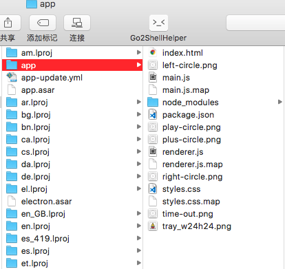
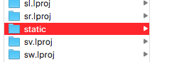
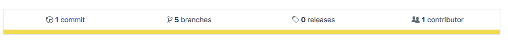

这一小节的  坑比较多，代码我会上传到 [Github](https://github.com/MiYogurt/electron-svelte-template/tree/package)

## 修改打包脚本

修改 `package.json` , 通过后置钩子，复制小图标。没有小图标打包后的应用会打不开，很难以发现这个问题，具体如何调试，后面再说。

```json
"compile": "NODE_ENV=production electron-webpack",
"postcompile": "cp ./src/main/tray_w24h24.png ./dist/main",
```

## 添加打包配置

修改 `package.json` ，添加一下配置，它来自于 [electron-build](https://www.electron.build/configuration/mac/) 其实基本上没有多少需要配置的，只需要配置个打包的图标即可。 `music.icns` 是使用 `svg` 文件（为了保证高精度）转换来的，使用的是 image2icon 。

```json
"name": "reader",
"version": "0.0.1",
"build": {
    "appId": "me.yugo",
    "mac": {
        "category": "me.yugo",
        "icon": "./music.icns"
    }
},
```

`npm run dist` 最终生成在 dist 的 yml 配置文件会像这样

```yml
directories:
  output: dist
  buildResources: build
extraMetadata:
  main: main.js
files:
  - from: .
    filter:
      - package.json
  - from: dist/main
  - from: dist/renderer
  - from: dist/renderer-dll
extraResources:
  - from: static
    to: static
appId: me.yugo
mac:
  category: me.yugo
  icon: ./music.icns
extends: electron-webpack/electron-builder.yml
electronVersion: 2.0.4
```

## 将 dock 的图标隐藏

在 `ready` 里面调用

```
app.dock.hide()
```

## 判断生产环境

在 createMainWindow 中，这里我  换了一种范式。

```js
import { format as formatUrl } from 'url'

if (process.env.NODE_ENV != 'production') {
  win.webContents.openDevTools()
  win.loadURL(`http://localhost:${process.env.ELECTRON_WEBPACK_WDS_PORT}`)
} else {
  win.loadURL(
    formatUrl({
      pathname: join(__dirname, 'index.html'),
      protocol: 'file',
      slashes: true
    })
  )
}
```

## 修复 Music.svelte 图标

图标显示会有异常我们修复一下。

```js
function getStaticPath() {
  const isDevelopment = process.env.NODE_ENV === 'development'
  const staticPath = isDevelopment
    ? ''
    : 'file://' + __dirname.replace(/app\.asar$/, 'static')
  return staticPath
}
```

添加到 data 里面去。

```js
data() {
    return {
        files: [],
        title: '',
        staticPath: getStaticPath() + '/'
    };
},
```

拼接 url

```html
<div class="flex">
    <button on:click="file()"></button>
    <button on:click="play()"></button>
    <button on:click="pause()"></button>
    <button on:click="prev()"></button>
    <button on:click="next()"></button>
</div>
```

## 关于路径

最终打包好的路径会像下图所示，并非如 compile 之后的 `dist` 目录所示，这是额外要注意的。





## 打包调试

> 如何解压 asar 文件

```bash
npm install -g asar
asar e app.asar app
```

> 如何调试

进入到解压后的 app

```
npx electron ./main.js
```

这样当有错误的时候，会在终端报出。

## 开始打包

```
npm run dist:dir
```

## 关于更新的说明

 对于打包，其实我有录制过非常详细的课程在我的个人网站可以寻到，之所以不讲的很细是因为  大多数人更希望知道如何快速吃到螃蟹，而不是烹饪螃蟹 🦀 。

更新在 `mac os` 需要苹果开发者认证证书签名，所以你需要付费，在 windows 下面可以不用签名。更新会用到一个 `latest-xxx.yml` 的文件，它在 dist 目录下，更新会拉取这个文件判断版本并进行更新，更新相关 API，Electron 内置。更新通常需要一个更新服务器，部署在云端。

## 发布到 Github

点击 release 按钮，上传即可。


