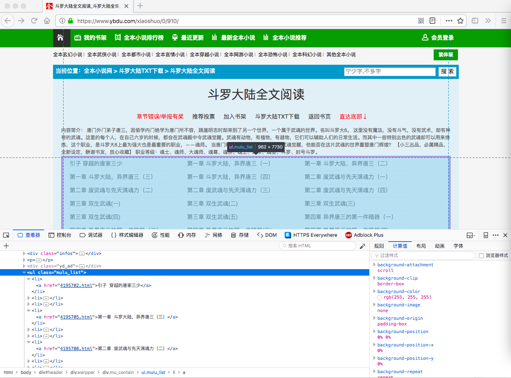
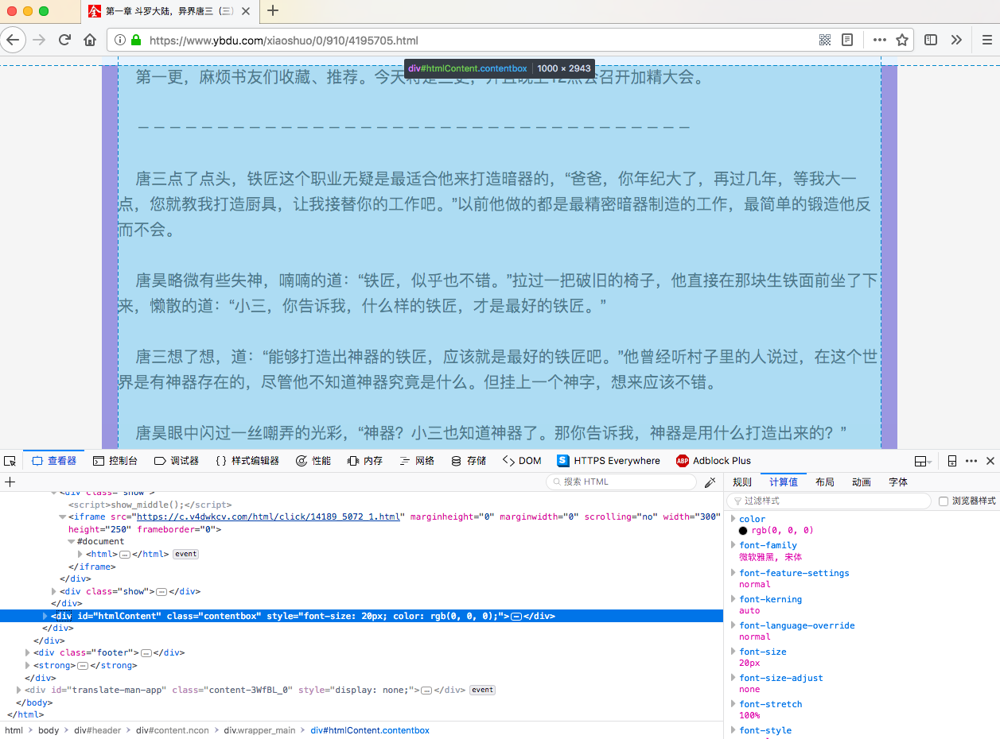

这一小节以 `JavaScript` 和函数式来讲解，下一节将通过 `TypeScript` 和 `Rxjs` 实现。现在我们先获取一个小说的内容和章节，然后存储到 json 文件里面，以这个 [斗罗大陆](https://www.ybdu.com/xiaoshuo/0/910/) 为例。

## 如何获取列表



`.mulu_list li` 选择器下面就是我们想要的内容，比较简单，`herf` 是链接，`text` 是标题。



对于文章内容则是 `#htmlContent`

首先预想一下，需要一个什么样的文件，提供什么样的功能？于是期望输入一个小说的网址，根据内置的爬取规则获取章节信息，首先保存章节信息到文件里面，然后继续爬取章节里面的内容，存储的地址同样是一个函数输入，并且我们希望控制一下并发量。

首先把它做成命令行的版本，便于直接测试，然后在后续再进行改写。

## 导入模块

- `phin` 是一个 node 下，基于 `net` 封装的一个请求模块，非常的小。
- `cherrio` 则是类似于 `jquery` 的 `dom` 选取器。
- `iconv-lite` 是纯 `javascript` 实现的一个字符编码解码器，主要用于解码 gbk，因为比较老的网站都是 gbk 编码的。
- `jsonfile` 可以方便的读取 `json` 文件，保存数据的时候会用到它。
- `url-join` 是拼接 `url` 的工具，有考虑到一些有 `query` 的情况，所以使用库拼接，而不是直接字符串拼接。
- `make-dir` 用来确保文件地址存在和创建文件。
- `ora` 则用于下载进度的显示

```js
const p = require('phin').promisified
const cheerio = require('cheerio')
const { decode } = require('iconv-lite')
const jsonfile = require('jsonfile')
const urljoin = require('url-join')
const { resolve } = require('path')
const fs = require('fs')
const mkdir = require('make-dir')
const ora = require('ora')
```

## 构建选择器

`pipeP`，第一个参数是 `Promise`，之后的参数都是 `then` 里面的回调，这样就再也不用看见 `then` 链了，然后将每一个环节进行分割，具体入下。

```javascript
// 拉取数据并且转码
const getHTML = (url, charset) => {
  return p(url).then(res => decode(res.body, charset))
}

// 装载内容，获取 $ 函数
const loadContent = source => {
  const $ = cheerio.load(source)
  return selector => {
    return $(selector)
  }
}

// 去掉 then 链接
const pipeP = (...args) => {
  return args.reduce((acc, prev) => acc.then(prev))
}

// 组合成构建 $ 函数
const buildSelector = (url, charset) =>
  pipeP(
    getHTML(url, charset),
    loadContent
  )
```

其实这个还有一些优化的方向，有的时候我们经常写出这样的函数，我们首先来看 `loadContent`

```js
const loadContent = source => {
  const $ = cheerio.load(source)
  return selector => {
    return $(selector)
  }
}
```

```js
const loadContent = cheerio.load
```

> 当一个函数的参数，原样传递给另外一个函数的时候，直接等于这个函数即可。

而对于 `getHTML` 也可以稍微优化一小下，到这个层次，我觉得就差不多了。

```js
const getHTML = (url, charset) =>
  pipeP(
    p(url),
    ({ body }) => decode(body, charset)
  )
```

那么还有没有继续优化的空间了呢，是有的。

```js
const decodeHTML = charset => body => decode(body, charset)
const getBody = ({ body }) => body
// 拉取数据并且转码
const getHTML = (url, charset) =>
  pipeP(
    p(url),
    getBody,
    decodeHTML(charset)
  )
```

那还可不可以继续优化呢，可以，不过需要用到帮助库 `ramda`，这里有一个问题使用 `curry` 自动柯里化的时候 `decode` 的 `length` 是 3，即接受 3 个参数 ，所以会导致出错。笔者调试了很久，最主要还是 API 文档导致的，API 上面显示的是两个参数，当我打印 `length` 的时候其实是 3 ，最后看了源码，发现有一个 `opts`，所以必须使用 `curryN` 表明个数，composeP 跟 pipeP 是顺序相反的，而且 `ramda` 的和笔者写的 `composeP` 跟 `pipeP` 有一些差异，`ramda` 的参数不是在第一个 `Promise` 里面传递的。这样优化，反而没有之前的清晰，这其实就属于过度的优化和函数式了，不要过度的函数式，也不要过度设计模式，过度的面向对象，物极必反。

```js
const { __, flip, curryN, composeP, prop } = require('ramda')
const decodeHTML = flip(curryN(2, decode)) // (方式一)
const decodeHTML = charset => curryN(2, decode)(__, charset) // (方式二)

const getHTML = (url, charset) =>
  composeP(
    decodeHTML(charset),
    prop('body'),
    p
  )(url)
```

更多函数式知识请[参考](https://adispring.coding.me/categories/Thinking-in-Ramda/)
