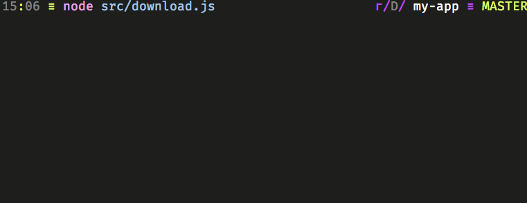
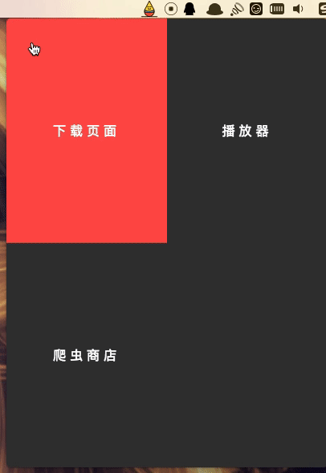
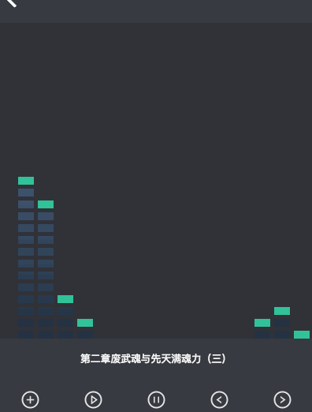

# 初识 Electron

---

### Electron 的起源

Electron 是由 Github 开发，用 HTML，CSS 和 JavaScript 来构建跨平台桌面应用程序的一个开源库。 Electron 通过将 Chromium 和 Nodejs 合并到同一个运行时环境中，来实现访问网络与本地文件系统的能力。

在 2013 年，Electron 最初的时候是属于 Github 开源代码编辑器 Atom 的一部分，在 2014 春季这两个项目相继开源。

**历史里程碑如下**
| 时间 | 里程碑 |
|---|---|
| 2013 年 4 月 | Atom Shell 项目启动 。|
| 2014 年 5 月 | Atom Shell 被开源 。|
| 2015 年 4 月 | Atom Shell 被重命名为 Electron 。|
| 2016 年 5 月 | Electron 发布了 v1.0.0 版本 。|
| 2016 年 5 月 | Electron 构建的应用程序可上架 Mac App Store 。|
| 2016 年 8 月 | Windows Store 支持 Electron 构建的应用程序 。|

### Electron 的优势

Electron 可以让 Web 应用程序运行在原生系统中，尽管在一些性能要求极其苛刻的场景下让人差强人意，但是对于普通的交互应用程序却完全可以融合，不仅开发效率高，还可以非常容易的让 Web 交互，应用到桌面端程序上面去。

它的主要优势有以下几点：

- 跨平台，一次书写运行在 Linux、Mac、Windows 上，降低开发成本。
- 具备浏览器不足的本地系统交互（编辑文件、启动网络服务）
- 强大的 npm 生态，提升开发效率
- 简单易学的 JavaScript 语言，基于 Web 的桌面开发，不用再去学习 C# 或者 Swift，降低学习成本。
- 苹果商店和微软商店都支持提交 Electron 应用程序。

### 应用前景

你想为你的 Node.js 应用、Web SPA 应用提供图形界面，Electron 都可以实现。

有一些硬件开发的同学把 Electron 应用到独立终端设备上面，比如说触屏打印等等之类，其实连接硬件设备也可以做到，不过是通过 c 或者 c++ 扩展的形式进行二进制通信而已，一般来说需要 c 或 c++ 的经验才能做到，当然假如能找到别人封装好的 npm 包，那么就可以非常省心的完成你想要的功能，个别依赖时候在编译时有些小问题，不过通过搜索 issus 可以解决大部分问题，所以也无需过多担心。

在硬件越来越强大的未来，性能终将不是问题，使用 Web 技术构建应用，不仅可以方便的实现各种动效，还有快速的开发效率，与低成本，对于一个现代企业来说，开发效率与快速更新迭代才是一个企业产品的根本。

尤其，近些年，基于 Electron 的应用程序越来越多，最熟悉的可能就是你每天在用的 VSCode、区块链的本地服务客户端 Ganache、 老虎证券的桌面客户端、SS 客户端 electron-ssr、图片灵感管理软件 Eagle、 微软的团队协助通讯工具、Slack 客户端、Twitter 客户端，H5 游戏白鹭引擎的 IDE 以及生态圈软件等等。

更多基于 Electron 的应用，可到访问 [Electron App Store](https://electronjs.org/apps) 查看。

### 本课程你能学到什么？

黑夜之中的 Electron 飞行法则，本达人课将教您最正确的 Electron 飞行姿势。点点滴滴带你完成一个懒人听书应用程序，从此看小说再也不用眼睛了。

整体来看，课程主要分为三部分：

- 第一部分：（第 01-08 课），带大这实现一个 Nodejs 命令行版本的爬虫，爬取所需的源数据。
- 第二部分：（第 09-19 课），使用 Electron 实现了爬取、转换、播放一体化的应用。
- 第三部分：（第 19 及以后），通过 Canvas 可视化音频数据。

本课程所覆盖到的技术关键词、核心内容，如下图所示：


学习完本课程你将学会使用 Electron 创建一个爬取小说网站数据源，并通过 Text To Speech 智能 AI 服务，将**文字转换成语音**，并将分散的**语音合并**，之后再通过 Electron 读取本地音频文件，并播放出来，当然为了让音乐播放器更加的契合播放器的功能，还会有如何一步步从创建 Canvas 动画到**可视化音频数据**的内容。为了适配更多的小说网站，我们还需要实现**插件机制**，并提供插件商店。

> 如何快速的学习 Electron API？

其实学习 API 最快速的方式就是下载和阅读 [API demo](https://github.com/demopark/electron-api-demos-Zh_CN) 应用程序，而本课只会把用到的给大家讲清楚，想要学习详细 API 的可以[点我免费学习](https://nodelover.me/course/electron-api-tutorial)

### 里程碑截图

#### 爬虫

先实现命令行的版本，再循序渐进的嵌入到 Electron 中，最初的想法可能只是一个小 demo



#### 商店

实现插件商店，利用一些 CSS 小动画，增加趣味交互。


#### 通知栏

将 Electron 应用，通过定位，修改成为通知栏小程序。


#### 下载

通过 Canvas 实现下载的进度条


#### 播放列表

 载入本地音频文件，并整理成播放列表


#### 可视化

最后将播放的音频，可视化到界面上去。


[下载体验连接](https://github.com/MiYogurt/electron-svelte-template/tree/package)，请仔细阅读使用说明。

### 不仅 Electron

在后面的章节，你将会实践一下前端新技术，在此之前，你可以先了解一下它们，学习新技术，增强你的竞争力。

#### Svelte

`Svelte` 是一款编译型的前端框架，类似于 `Vue.js` 的语法，只不过它零依赖，把所有的模板和逻辑都编译成字符串拼接与 `js` 文件，所以也被成为会消失的框架。看起来会类似于下面这样。

```js
import App from './App.svelte'

const app = new App({
  target: document.querySelector('#app'),
  data: { name: 'world' }
})

app.set({ name: 'everybody' })
app.destroy()
```

#### 函数式编程

其实就是一切皆函数，同时函数可以作为参数，也可以做为返回值，直观的体验下会像下面这样。

```js
const getHTML = (url, charset) =>
  pipeP(
    p(url),
    getBody,
    decodeHTML(charset)
  )

getHTML('https://xxxxx.com', 'utf-8')
```

#### Rxjs

`Rxjs` 是 `ReactiveX` 编程理念的 `JavaScript` 版本，同时也比较符合函数式编程的哲学，可以理解为函数式编程的升级版。`ReactiveX` 来自微软，`ReactiveX` 不是一个新东西，但用在前端领域绝对是一个伟大的尝试，它是一种针对异步数据流的编程，前端最多的就是异步。简单来说，它将一切数据，包括 HTTP 请求，DOM 事件或者普通数据等包装成流的形式，然后用强大丰富的操作符对流进行处理，使你能以同步编程的方式处理异步数据，并组合不同的操作符来轻松优雅的实现你所需要的功能。

```ts
const getSelector = (url: string, charset?: string) =>
  request(url).pipe(
    map(handleFollowRedirect),
    concatAll(),
    pluck('body'),
    map(decodeCharset(charset)),
    map(toSelector),
    catchError(err => {
      log({ type: 'crawl', step: 'error', message: err.message })
      return of(err)
    })
  )
```

### 适宜人群

- 具备一定的 Nodejs 基础，至少做过一个完整项目。
- 具有一些 JavaScript 的基础
- 想要进军桌面端程序开发
- 想要实践重构、函数式编程与设计模式

### 本课程开发环境和特别说明

**开发环境**

- **MacOS**
- 开发工具：VSCode 1.25.1
- 本机 Node 版本：9.4.0
- Electron 版本：2.0.5
- Svelte 版本：2.9.7

**特别说明**

本实践最主要以 Mac 平台下的通知栏应用程序为例讲解 Electron 的实践，对于多平台需要自行对一些平台的方法做一些兼容，其实就是一些 API 一些差异而已，比如 Windows 没有 Dock 栏。通过 if 做一些判断即可。

 特别注意的是你的原生依赖一定要跨平台，要不然是无法工作的，或者在某些平台下面使用替代的方案等，比如在 Mac 下面使用 `mp3-concat` ，而在 Windows 下面使用 `ffmpeg` 。

### 关于 Electron 的资源

在 [社区板块](https://electronjs.org/community) 可以找到所有关于 Electron 的资源，包括有用的工具，脚手架等等。
